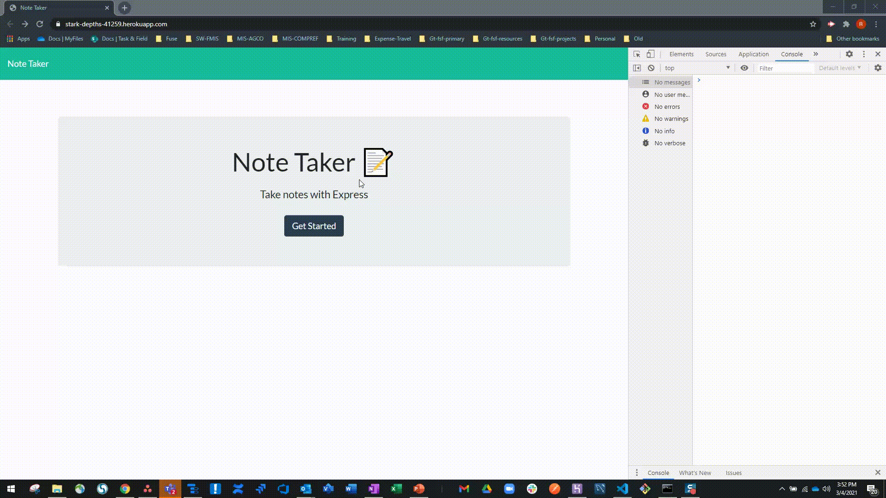

# gt_fsf_hw11_note_taker

## Table of Contents
1. [Description](#Description)
3. [Usage](#Usage)
4. [Installation](#Installation)
5. [Licenses](#Licenses)
6. [Questions](#Questions)
7. [Credits](#Credits)

## Deployed Application
This is the link to the deployed application Heroku. It will take you to the application landing page. 

https://stark-depths-41259.herokuapp.com/

## Description
For this assignment we asked to complete a basic note taking application that satisfied a set of defined acceptance criteria. It was our first experience setting up a server, and working with both server and client side code. We were given some starter code (javascript) and some html / css as client resources. We were asked to complete the client side code, and write from scratch our server side code using node and related libraries such as express. I did not update any of the CSS or HTML although had this been a real application I would have, as its pretty basic and using and older version of bootstrap.

Below is a short video demo, carried out using my deployed application on Heroku. 

**Demo Video For Main Application**

Using express, I setup some routes for the client side api calls. Routes were setup to work with some defined GET, POST, and DELETE methods. Some basic routes were setup to return the appropriate html pages, and some additional routes were setup to manage the retrieval, addition, and deletion of notes from the server. 

All notes were kept as an array of objects in a JSON file. When updating the file, I would always read the file in, make the update, then write it back to the DB. Then a subsequent get notes function was called in the client side to pull the updated version and display it accordingly. I followed a similar logic to handle delete requests. 

Each time  note comes in via POST, before adding it to the JSON db I create a uuid with it using an express library for uuid. An id is required for the subsequent get method to return anything to the. Furthermore, I use the id to identify which element to delete from the JSON should somebody click the delete method so this was important to include.

I did read and decomposed the client side code, as it was a little messy at first glance so it was important to make sure I understood how it was setup so I could create the server for it. To do this I just went through and commented out the code, as well as created some user pseudo code at the bottom so that the user flow was clear. Lastly, I made some minor adjustments to fix some things that were not quite working or needed modification to work with the routes I setup on the server. 

**Screenshot of Client Side HTML Pseudo Code For User Flow** 

**Screenshot of Screenshot of Client Side HTML Updated With Comments For Easier Tracking During Development**   

## Usage
This application can be used to take and store some quick notes. You can access it from anywhere you have an internet connection. 

## Installation
This application can be used as long as you have the correct URL. For building it or modifying the code, you will need to run npm i in the CLI to get needed dependencies. Namley, express and uuid note libraries. 

## Licenses
  
https://opensource.org/licenses/MIT

## Questions
Email me at ryanjohnson9685@gmail.com for more information.

## Credits
For this assignment I utilized class notes and recordings, as well as some MDM and W3 schools. I also reviewed the npm documentation for express and uuid for specific questions dealing with use of those libraries.